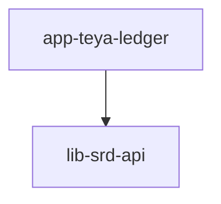

# TEYA LEDGER

## Step #0 - initial workspace setup

Project name, Git repo, README (where I'm also going to track time spent)

// 5 min spent

## Step #1 - Interview the Client and functional analysis

// Understand functional requirements...

### Known functional requirements:

* Ability to record money movements (ie: deposits and withdrawals)
* View current balance
* View transaction history

### Clarifying questions:

// This part is based only on my assumptions in order to keep system simple

* Q: Multi users (keep ony single tenant vs multi account) - A: Please try to keep it simple - one global account
* Q: Multi Currency - A: omitted.
* Q: Dealing with overdrafts (i.e. going to negative balance) - A: NO, block
* Q: Deposits/Withdrawals (Transactions) validation (i.e. min/max) - A: let's stick to +- 1000.00 min/max per
  transaction
* Q: Deposits/Withdrawals (Transactions) reference/description - A: NO
* Q: !!! Deposits/Withdrawals (Transactions) idempotency - A: not yet
* Q: Precision - A: use industry standards
* Q: Current Balance storage (dynamic on the fly calculation by transaction history vs aggregated state) - A: use
  industry standard
* *** Q: Current Balance (like in banks) available (reserved transactions) vs actual - A: keep simple
* Q: Transaction filtering (pagination, deposit/withdrawls, dates, etc...) - A: omitted, return all records
* Q: Transaction ordering (by date, by ??? ) - A: omitted, return as is from BD

### Non functional boundaries (TBD)

* P: Using in-memory BD or Structure we are going to lose all data up on restart. - S: let's add "data initializer"
* P: Let's add H2 DB support to demonstrate "transactions", not only "synchronized blocks"

// 20 min spent

## Step #2 - Technical Requirements

### Tech Stack

* Language & Framework: java 21, Spring Boot 4.x
* Build Tool: Gradle
* Database: H2 In-Memory
* Containerization: Docker/Docker Compose

// 10 min spent

## Step #3a Architecture Design

* Demonstrate CQRS & Event Sourcing (see Step #3b) - to satisfy "Current Balance storage" alignment with fintech
  industry standards
* Demonstrate application modularity - extract API layer into reusable shared library (maybe to be used in other
  services or apps, like android)

## Step #3b we detected a demand to demonstrate CQRS & Event Sourcing...

### Why Not Simple CRUD?

In payments, updating a single balance column via standard CRUD (UPDATE accounts SET balance = balance - X) is a major
anti-pattern. It destroys the audit trail, makes synchronization difficult, and creates severe database locking issues
under high concurrent loads

### Let's try to implement CQRS & Event Sourcing

#### Event Sourcing / Command Side

* Source of Truth: Transactions are written to append-only immutable log,
* Immutability: Once a record is inserted into the H2 database, it can never be updated or deleted. If an error occurs,
  a new compensating transaction must be recorded.
* Concurrency Safety: Spring Data JPA pessimistic/optimistic locking or serialized state execution is utilized to
  prevent race conditions during simultaneous balance deductions.

#### Projection / Query Side

* High Performance (O (1) Queries): To prevent the API from executing expensive SUM (amount) aggregates over millions of
  records every time a user requests /api/v1/balance, the system maintains a Materialized Projection of the current
  balance
* Synchronization: When a new DEPOSIT or WITHDRAWAL command successfully validates and writes to the immutable
  transaction log, a localized event updater immediately recalculates and updates the cached current balance state
* Production Scaling Scalability: In this tiny ledger, both models sit within the same H2 database runtime context.
  However, this architectural decoupling ensures that in a production ecosystem, the Write side can seamlessly scale
  using Apache Kafka, while the Read side can be offloaded to highly available replica instances or a Redis caching
  cluster.

// 15 min spent

## Step #4 - Prepare sandbox

Here I'll skip logical next step of architectural design, like define endpoints and responses, module diagrams and so
on.

Example

```bash
curl -X POST http://localhost:8080/api/v1/ledger/transactions \
-H "Content-Type: application/json" \
-d '{"type": "DEPOSIT", "amount": 250.50}'
```

or drawing diagrams



I would jump right into project initial setup/config (setup spring boot, dependencies, etc.)

!!! keep in mind, Swagger OpenAPI will do all documentation job for us...

In this step I satisfied one of the requirements: "Demonstrate application modularity".

// 20 min spent

## Step #5 - Out of scope (extra) preparation step

I would like to ensure that so far My app is able to compile, build and launch. During application development I prefer
to reduce potential point of failures.

I want to be sure that Swagger works and we can guaranty on the fly rest call executions. Beside of that, as a side
effect, I will get a basic package (layers) structure. I would like quickly create an endpoint that shows "application
version", let's spend extra 10 min for that

now you can see all your endpoints definitions under http://localhost:8080/swagger-ui/index.html

// 20 min spent - shows my original estimate versus actual

## Step #6 - Define "Model" layer

3 classes needs to be created:

* TransactionType - just to show transaction direction: DEPOSIT/WITHDRAWAL
* Transaction - immutable event log to satisfy CQRS
* Balance - projection, like current balance cashing

#### Trade-off / Decisions

* BigDecimal or long - for amount fields I chose the long type, which represents the amount in cents. As:
    - prevent rounding errors
    - lightweight append-only log for Event Sourcing
    - efficiency for DB

// 20 min spent

## Step #7 - Define "Repository" layer

2 repo needs to be created:

* BalanceRepository
* TransactionRepository

#### Trade-off / Decisions

* JpaRepository or CrudRepository - JpaRepository. As:
    - cash control - methods .flush () and .saveAndFlush ()
    - generic Lists, instead Iterable
    - minor - pagination support

// 15 min spent

## Step #8 - Define "Service and Controller" layer

Before jumping to most interesting part of transaction movement implementation, lets define REST controller and service
layers

* LedgerRestController added.
* LedgerService added - here I prefer explicitly work with interfaces and actual impl classes.


* GET /api/v1/history added
* GET /api/v1/balance added

Results are checked in Swagger

// 15 min spent

## Step #9 - Money Movement

During this step I succeeded in primitive/simplified way to develop one of architectural patterns CQRS, securing
"Ability to record money movements" requirement.

// 25 min spent (including me playing with endpoints - i.e. testing)

## Step #10 - Let's check all business requirements before wrapping an application

// Skipping ... // Here suppose to be checklist

## Step #11 - Chery on the pie - Docker & Launch

From requirments: "We expect you to deliver a functional web application (no UI, just the apis)
that can be run locally."

Here we go:

#### Run in docker build and deploy

```bash
docker compose up --build -d
```

#### Test and enjoy application

* as option, I recomment to use "Swagger" http://localhost:8080/swagger-ui/index.html
* Postman
* or curl

```bash
curl.exe -X POST http://localhost:8080/api/v1/movement -H "Content-Type: application/json" -d "{\`"type\`": \`"DEPOSIT\`", \`"amount\`": 10000}"
```

```bash
curl.exe -X GET http://localhost:8080/api/v1/balance
```

```bash
curl.exe -X GET http://localhost:8080/api/v1/history
```

#### Shutdown containers

```bash
docker compose down
```


